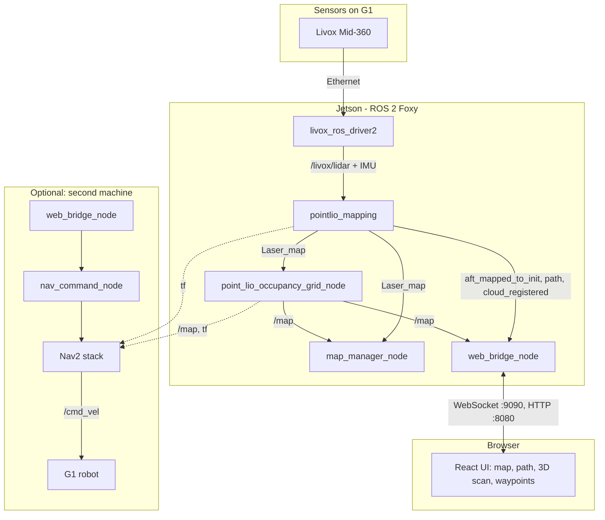
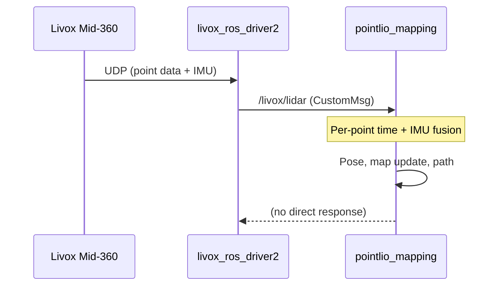
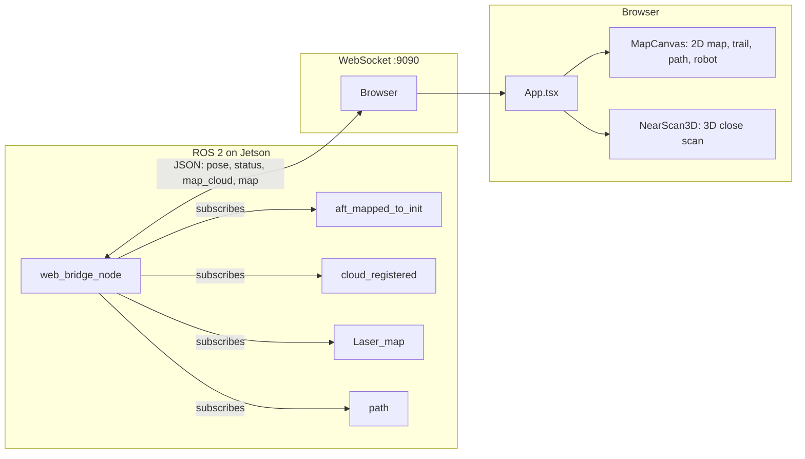
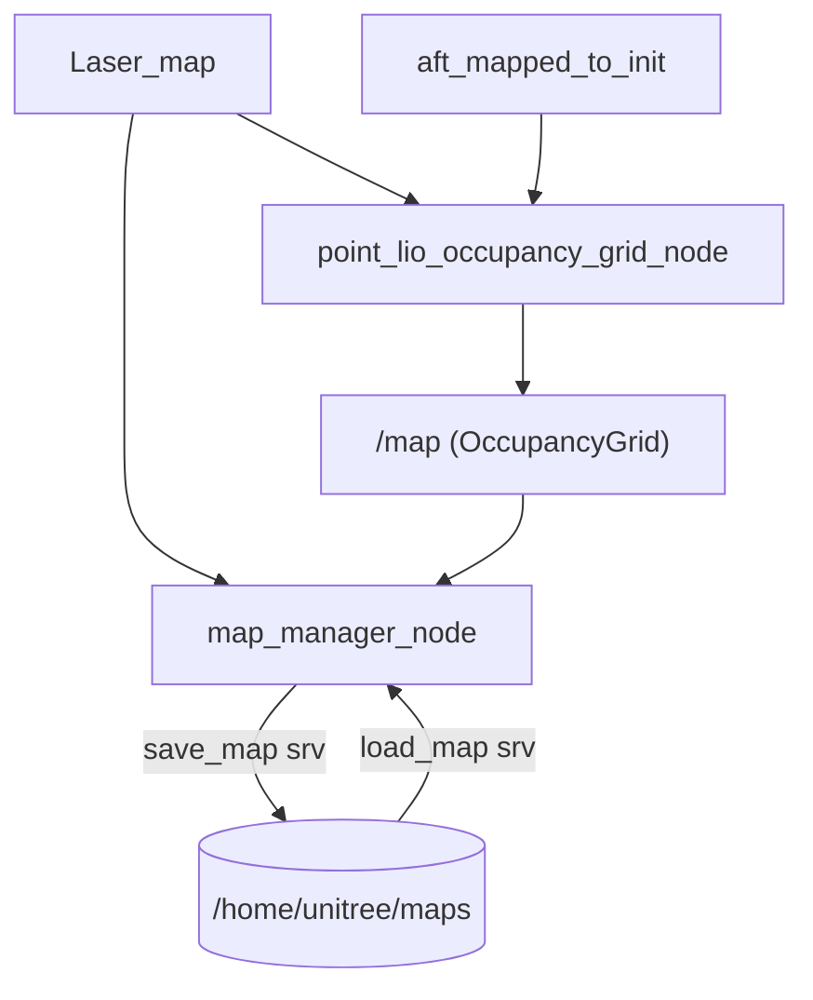
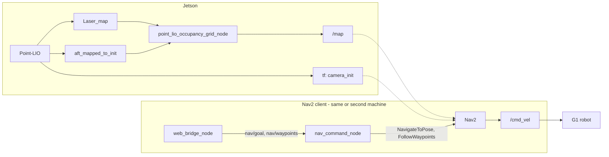

# Unitree G1 + Jetson: Architecture and Data Flow

This document describes how the mapping, localization, web interface, and optional waypoint navigation fit together when running on a **Unitree G1** humanoid robot with an **NVIDIA Jetson** (ROS 2 Foxy, Livox Mid-360).

---

## 1. Overview

| Component | Role |
|-----------|------|
| **Livox Mid-360** | LiDAR + IMU on the robot; publishes raw scan data. |
| **livox_ros_driver2** | ROS 2 driver; publishes `/livox/lidar` (CustomMsg) and IMU. |
| **Point-LIO** (`pointlio_mapping`) | LiDAR–Inertial Odometry: fuses scan + IMU, outputs pose, map cloud, and path. |
| **point_lio_occupancy_grid_node** | Converts Point-LIO’s point cloud map into a 2D occupancy grid for Nav2. |
| **map_manager_node** | Save/load map (point cloud + grid) to disk; provides `save_map` / `load_map` services. |
| **web_bridge_node** | WebSocket + HTTP server: streams pose, scan, map, path to the browser; forwards nav goals. |
| **Nav2 + nav_command_node** | Path planning and waypoint following; consumes `/map` and sends velocity commands. |

**Typical hardware:** G1 with Jetson (e.g. Orin NX) running Ubuntu 20.04, ROS 2 Foxy. Livox Mid-360 connected over Ethernet (e.g. 192.168.123.x).

---

## 2. High-Level Architecture



- **Solid lines:** Data flow on the Jetson (sensors → driver → Point-LIO → occupancy grid, map manager, web bridge → browser).
- **Dashed lines:** Optional second machine: Nav2 and nav_command_node subscribe to `/map` and tf from the Jetson; web bridge on that machine sends goals to Nav2.

---

## 3. Data Flow: Sensors to Point-LIO



1. **Livox** sends point clouds and IMU over Ethernet to the Jetson.
2. **livox_ros_driver2** publishes:
   - `/livox/lidar` (CustomMsg with per-point timestamps)
   - IMU topic (configurable name)
3. **pointlio_mapping** subscribes to lidar + IMU, runs LiDAR–Inertial Odometry, and publishes:
   - **`/aft_mapped_to_init`** (Odometry): robot pose in map frame (`camera_init`).
   - **`/Laser_map`** (PointCloud2): accumulated 3D map.
   - **`/cloud_registered`** (PointCloud2): current scan in map frame.
   - **`/path`** (Path): trajectory so far.

All map/pose frames use **`camera_init`** by default (Point-LIO convention).

---

## 4. Topic and Frame Summary

| Topic / Frame | Type | Producer | Consumer | Description |
|---------------|------|----------|----------|-------------|
| `/livox/lidar` | CustomMsg | livox_ros_driver2 | pointlio_mapping | Raw Livox points + timestamps |
| `/aft_mapped_to_init` | Odometry | pointlio_mapping | occ grid, web bridge, Nav2 | Robot pose in map frame |
| `/Laser_map` | PointCloud2 | pointlio_mapping | occ grid, map_manager | Full 3D map |
| `/cloud_registered` | PointCloud2 | pointlio_mapping | web bridge, Nav2 costmap | Current scan in map frame |
| `/path` | Path | pointlio_mapping | web bridge | Trajectory (path so far) |
| `/map` | OccupancyGrid | point_lio_occupancy_grid_node | map_manager, Nav2 | 2D grid for planning (frame: camera_init) |
| **TF** | camera_init → body/odom | pointlio_mapping | Nav2, RViz | Map to robot transform |

**Important:** Nav2 and the occupancy grid use **`camera_init`** as the global (map) frame, not `map`. Ensure base_link (or body) is connected in the TF tree (e.g. via robot driver or static publisher).

---

## 5. Web Interface Flow



- **web_bridge_node** (with `use_point_lio: true`):
  - Subscribes to `aft_mapped_to_init`, `cloud_registered`, `Laser_map`, `path`.
  - Down-samples scan to ~800 points per message for responsiveness.
  - Sends JSON over WebSocket: `pose`, `status` (with `scan_points`), `map_cloud`, `map` (trajectory).
- **Frontend** (React):
  - **MapCanvas:** 2D view: persistent trail (occupancy grid, no decay), near scan (&lt;2 m, last 2 frames), path, robot pose. Uses an offscreen canvas for the trail (single `drawImage` per frame).
  - **NearScan3D:** Small 3D panel (Three.js) for the &lt;2 m scan with orbit controls.
- **HTTP :8080** serves the built React app (e.g. `http://<robot-ip>:8080`).

---

## 6. Map Save and Occupancy Grid



- **point_lio_occupancy_grid_node** (launched with `use_occ_grid:=true`):
  - Subscribes to `Laser_map` and `aft_mapped_to_init`.
  - Builds a 2D occupancy grid (height filter, log-odds, ray-casting for free space).
  - Publishes **`/map`** (frame_id `camera_init`) for Nav2.
- **map_manager_node** (always run with Point-LIO launch):
  - Subscribes to `Laser_map` and `/map`.
  - **save_map** service: writes point cloud (PCD) and optional grid (PGM + YAML) to `/home/unitree/maps/`.
  - **load_map** service: loads PCD and republishes; grid YAML can be used by Nav2’s map_server for “load saved map” runs.

---

## 7. Waypoint Navigation (Nav2)



- **Nav2** needs:
  - **`/map`** (OccupancyGrid, frame `camera_init`).
  - **TF** from `camera_init` to `base_link` (and optionally odom).
  - For Point-LIO, use **nav2_params_point_lio.yaml** (global_frame: `camera_init`, costmap topics e.g. `/cloud_registered`).
- **nav_command_node** subscribes to **`nav/goal`** (PoseStamped) and **`nav/waypoints`** (WaypointList) from the web bridge and calls Nav2 actions (NavigateToPose, FollowWaypoints).
- **cmd_vel** is sent to the G1 (via your robot base controller / SDK).

**Single machine:** Run `point_lio_mapping.launch.py use_occ_grid:=true` and then `point_lio_navigation.launch.py` on the Jetson.  
**Two machines:** Run mapping + occ grid (and optionally web) on the Jetson; run `point_lio_navigation.launch.py` on a PC/second Jetson with same ROS_DOMAIN_ID and network so it receives `/map` and tf.

---

## 8. Deployment Modes

| Mode | Jetson runs | Second machine | Use case |
|------|-------------|----------------|----------|
| **Mapping + RViz** | Livox driver, Point-LIO, (optional) web | — | Build map, visualize in RViz or browser |
| **Mapping + Web** | Livox, Point-LIO, web_bridge | — | Same + web UI at :8080 |
| **Mapping + Occ grid + Web** | Livox, Point-LIO, point_lio_occupancy_grid_node, map_manager, web_bridge | — | Map + save_map + /map for later Nav2 |
| **+ Nav2 (single)** | Above + point_lio_navigation.launch.py (Nav2, nav_command_node, web) | — | Full waypoint nav on Jetson |
| **+ Nav2 (two-machine)** | Livox, Point-LIO, occ grid, (optional) web | Nav2, nav_command_node, web_bridge | Nav2 and UI offloaded to keep Jetson focused on localization |

---

## 9. Build and Run (Jetson, Foxy)

**One-time setup:**

```bash
source /opt/ros/foxy/setup.bash
source ~/ws_livox/install/setup.bash
cd /path/to/state_e/g1_slam_nav
colcon build --symlink-install --cmake-args -DCMAKE_BUILD_TYPE=Release
source install/setup.bash
```

**Every session (sourcing):**

```bash
source /opt/ros/foxy/setup.bash
source ~/ws_livox/install/setup.bash
source /path/to/state_e/g1_slam_nav/install/setup.bash
```

**Start Livox (terminal 1):**

```bash
ros2 launch livox_ros_driver2 msg_MID360_launch.py
```

**Start Point-LIO + web (terminal 2):**

```bash
ros2 launch g1_bringup point_lio_mapping.launch.py use_web:=true
```

**With occupancy grid and map save (for Nav2 later):**

```bash
ros2 launch g1_bringup point_lio_mapping.launch.py use_web:=true use_occ_grid:=true
```

**Web UI:** `http://<jetson-ip>:8080`  
**RViz (optional):** `ros2 launch g1_bringup point_lio_mapping.launch.py rviz:=true`

---

## 10. References

- **COPY_TO_JETSON.md** – What to copy, build order, web frontend build, two-client setup.
- **POINT_LIO_JETSON.md** – Point-LIO and Livox build/run on Jetson.
- **point_lio_mapping.launch.py** – Mapping + optional occ grid + map_manager + web.
- **point_lio_navigation.launch.py** – Nav2 + nav_command_node + web for waypoint navigation.
- **nav2_params_point_lio.yaml** – Nav2 parameters for `camera_init` frame and Point-LIO topics.
